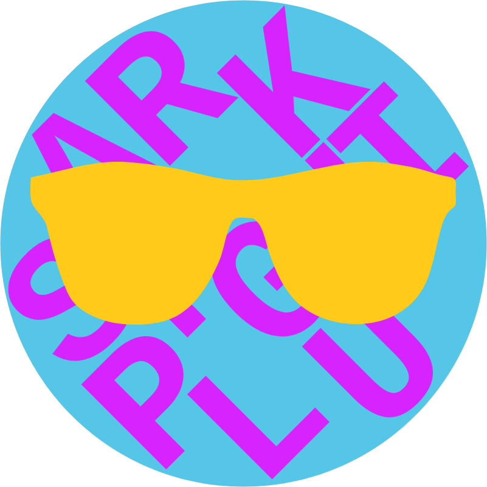

    

<h3 align=center>
   
Software that displays decoded Sparkplug messages from MQTT IoT

</h3>

   Windows, macOS and Linux

   
     
    Made with ❤️ by <a href="https://ambre.io/">Ambre.io</a>

- [Get Started](#-get-started)
- [Usage Details](#-usage-details)
- [Technical Stack](#-technical-stack)
- [Development](#-development)

## ☀️ Get Started

1. Download the **Windows**, **macOS** or **Linux** latest
   release: https://github.com/Ambre-io/sparkplugui/releases/latest
2. Launch SparkpluGUI
3. Setup your server connection with the **MQTT Information** panel. Possibly in TLS.
4. Connect and starts to receive messages in the **Messages** and the **Topics Tree** panels.
5. Click on a tree branch and see the message in **Last Message** panel.

💡 Use the window small for the MQTT setup mode then enlarge it in width for the reading mode.

## 📚 Usage Details

### Select 🗣️ Language

Choose your favorite language:  🇺🇸 🇩🇪 🇫🇷 🇮🇹 🇹🇳 🇯🇵 🇺🇦 🇷🇺 🇪🇸 🇨🇳 🏴󠁣󠁮󠀶󠀵󠁿 🏴󠁺󠁡󠁮󠁬󠁿 🏴󠁩󠁲󠀱󠀶󠁿

It's saved automatically.

### Button ☁️ Connect/Disconnect

*Connect* the software to the defined server in the **MQTT Information** panel and subscribe to the topic.

*Disconnect* the software from the MQTT server, after unsubscribe the topic,
to stop the flow or to modify the topic subscription for instance.

#### MQTT Information

|                                 Fields | Description                                          | Required | Saved |
|---------------------------------------:|:-----------------------------------------------------|:--------:|:-----:|
|                               **Host** | MQTT server IP or domain name                        |    x     |   x   |
|                               **Port** | MQTT server port                                     |          |   x   |
|                              **Topic** | Choose a topic to track what you need                |    x     |   x   |
|                    **Username  [TLS]** | Use a valid username for the authentication          |          |       |
|                     **Password [TLS]** | Use a valid password for the authentication          |          |       |
| **Concatenated CA certificates [TLS]** | TLS certificate from the trusted authority (CA.pem)  |          |       |
|           **Client certificate [TLS]** | Client certificate signed by the CA (client-crt.pem) |          |       |
|                   **Client key [TLS]** | Keyfile for the client certificate (client-key.pem)  |          |       |

💡 In order to use the software in the best conditions please restrict your search to a specific topic.

💡 If you need to authenticate the software to the MQTT server, please fill the 5 TLS fields to use an optimal and
secure connection.

### Button ↕️ Open/Close

*Open* the entire tree for easy access to your nodes and devices.

*Close* the entire tree.

### Button 🔒 Unlock/Lock

*Unlock* button gives access to **MQTT Information**, **Messages**, **Topics Tree** and **Last Message** customization:

- choose the window size
- move panels by drag and drop
- resize panels from the bottom right corner

*Lock* the customization in order to use the software.

It's saved automatically.

## 🤓 Technical Stack

Thank you all for the beautiful technologies:

- [Wails](https://wails.app/) for the Go/TypeScript framework
- [Go](https://golang.org/) for the language
- [TypeScript](https://www.typescriptlang.org/) for the language
- [React](https://reactjs.org/) for the composition
- [Redux Toolkit](https://redux-toolkit.js.org/) for the state management
- [Material UI](https://material-ui.com/) for the UI
- [Emotion](https://emotion.sh/docs/introduction) for the CSS
- [React JSON View](https://raw.githack.com/uiwjs/react-json-view/v1-docs/index.html) for the JSON display
- [React Spring](https://www.react-spring.io/) for the animations
- [i18next](https://www.i18next.com/) for the internationalization
- [React Grid Layout](https://github.com/react-grid-layout/react-grid-layout) for the customizable layout
- [React Toastify](https://fkhadra.github.io/react-toastify/introduction/) for the toasts
- [Vite](https://www.npmjs.com/package/@vitejs/plugin-react) for dev and build
- [DefinitelyTyped](https://github.com/DefinitelyTyped/DefinitelyTyped) for the types
- [ESLint](https://eslint.org/) for the linting
- [Sparkplug](https://www.cirrus-link.com/) for the protocol
- [MQTT](https://mqtt.org/) for the protocol
- [Paho](https://github.com/eclipse/paho.mqtt.golang) for the MQTT client
- [Protobuf](https://pkg.go.dev/google.golang.org/protobuf) for the Sparkplug payloads
- [Sparkplug Client](https://github.com/weekaung/sparkplugb-client) for the code base
- [GitHub](https://github.com) for the nice pace
- [JetBrains](https://www.jetbrains.com/) for the Rock Star IDE's
- and many others 🙏

## 👨‍💻 Development

| Step             | Action                                                     |
|:-----------------|:-----------------------------------------------------------| 
| Install go       | https://go.dev/doc/install                                 |
| Update your path | `export PATH="\$PATH:$HOME/go/bin"`                        |
| Install wails    | `go install github.com/wailsapp/wails/v2/cmd/wails@latest` |
| Install required | `sudo apt install libgtk-3-dev libwebkit2gtk-4.1-dev`      |
| Run dev          | `wails dev -tags webkit2_41`                               |
| Run build        | `wails build -tags webkit2_41`                             |
| Helper           | `wails doctor`                                             |
| Golang config    | Settings > Go > Go Modules > Enable Go modules integration |
